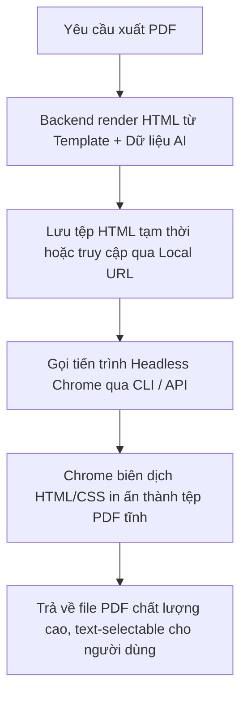

# Technical Specification: Headless Chrome HTML-to-PDF Compilation for Vitba Report

Tài liệu này đặc tả kỹ thuật và thiết kế hệ thống xuất báo cáo chiến lược dạng PDF chất lượng cao từ giao diện HTML/CSS bằng cách sử dụng trình duyệt Google Chrome ở chế độ chạy ẩn (**Headless Chrome HTML-to-PDF Compilation**).

Đây là phương pháp thay thế hoàn hảo cho các thư viện render phía Client như `html2canvas` kết hợp `jsPDF` (thường gây vỡ chữ, nhòe ảnh, không cho sao chép text và lỗi ngắt trang ngẫu nhiên).

---

## 1. Tổng quan Kiến trúc (Architecture Overview)

Khi người dùng xuất báo cáo, hệ thống sẽ thực hiện quy trình sau:



### So sánh Giải pháp

| Tiêu chí | Client-side jsPDF + html2canvas | Headless Chrome HTML-to-PDF |
| :--- | :--- | :--- |
| **Độ sắc nét của chữ** | Kém (được chụp thành ảnh canvas rồi phóng to) | Tuyệt đối (văn bản vector sắc nét ở mọi mức zoom) |
| **Khả năng sao chép (Copy text)** | Không (bản chất là file ảnh bọc trong PDF) | Có (chọn và sao chép văn bản bình thường) |
| **Bố cục ngắt trang (Page Break)** | Lỗi (cắt đôi chữ, bảng biểu ở rìa trang) | Hoàn hảo (điều khiển chính xác qua CSS Page Break) |
| **Phong cách & Trực quan** | Giới hạn bởi canvas | Hỗ trợ 100% Flexbox, Grid, Google Fonts, SVG, CSS Gradient |
| **Tốc độ render** | Chậm (gây lag trình duyệt của user khi tài liệu dài) | Cực nhanh (xử lý trực tiếp bởi Chrome Engine) |

---

## 2. Brand Identity & Grid Layout của Vitba Report

Để đảm bảo tính nhất quán của thương hiệu **Vitba.ai**, các tài liệu in ấn PDF phải tuân thủ nghiêm ngặt hệ thống thiết kế dưới đây.

### 2.1. Bảng màu thương hiệu (Brand Palette)
Hệ màu in ấn được đồng bộ từ `globals.css` của ứng dụng web, tối ưu hóa để hiển thị sang trọng và tiết kiệm mực in:

* **Màu Nền Chính (Background):** `#FAF8F5` (Màu cát nhạt / Sand Light - tạo cảm giác organic, cao cấp hơn màu trắng tinh).
* **Màu Văn Bản Chính (Text Main):** `#201B18` (Charcoal ấm / Ấm áp đen - dễ đọc, dịu mắt hơn màu đen tuyền).
* **Màu Văn Bản Phụ (Text Muted):** `#6B6055` (Xám ấm / Warm Gray).
* **Màu Điểm Nhấn (Accent Primary):** `#FFB300` (Vàng Amber / Gold - tượng trưng cho giá trị cốt lõi, đột phá).
* **Màu Điểm Nhấn Phụ (Accent Secondary):** `#FF8F00` (Cam Gold / Dark Amber).
* **Màu Viền (Border):** `#EFEAE2` (Màu sữa nhạt / Milk - viền trang nhã).

### 2.2. Typography (Phông chữ)
Sử dụng các font chữ chuyên nghiệp từ Google Fonts:
* **Tiêu đề (H1, H2, H3, H4):** `Manrope` (Bold, tạo cảm giác hiện đại, vững chãi).
* **Nội dung (Body text, Tables, Metadata):** `Inter` (Regular/Medium, tối ưu hóa khả năng đọc).

### 2.3. Cấu trúc thương hiệu ở góc trái trên (Vitba Top-Left Branding)
Trên tất cả các trang nội dung (ngoại trừ trang bìa), góc trái trên của tài liệu bắt buộc phải có thương hiệu Vitba gồm:
1. **Logo Icon:** SVG Vector dạng chữ V cách điệu với dải gradient vàng Amber.
2. **Logo Text:** Chữ **Vitba.ai** bằng phông `Manrope` (Semibold, màu Charcoal).
3. **Report Meta:** Nhãn hiệu báo cáo (VD: `REPORT: Báo Cáo Chiến Lược`).

---

## 3. Thiết kế Cấu trúc HTML phân trang (HTML Layout Setup)

Tài liệu được thiết kế theo dạng phân trang tĩnh, mỗi trang là một khối `div.page` độc lập. Kích thước của mỗi trang khớp chính xác với tỷ lệ A4 tiêu chuẩn (210mm x 297mm).

```html
<div class="deck-container">
  
  <!-- TRANG 1: TRANG BÌA (COVER PAGE) -->
  <div class="page" id="page-1">
    <div class="cover-content">
      <!-- Logo thương hiệu lớn ở giữa hoặc góc trên -->
      <div class="cover-brand">
        <svg class="cover-logo" ...></svg>
        <span class="cover-logo-text">Vitba.ai</span>
      </div>
      
      <!-- Tiêu đề báo cáo và thông tin dự án -->
      <h1 class="cover-title">BẢN BÁO CÁO CHIẾN LƯỢC</h1>
      <h2 class="cover-subtitle">Vitba Comprehensive Strategy & Marketing Report</h2>
      
      <div class="cover-metadata-card">
        <div class="meta-row"><span>Doanh nghiệp:</span><strong>[Tên Dự Án]</strong></div>
        <div class="meta-row"><span>Ngành hàng:</span><strong>[Lĩnh Vực]</strong></div>
        <div class="meta-row"><span>Ngày tạo:</span><strong>[Ngày tạo báo cáo]</strong></div>
        <div class="meta-row"><span>Bản quyền:</span><strong>Vitba.ai Strategist Team</strong></div>
      </div>
    </div>
  </div>

  <!-- TRANG 2: MỤC LỤC & EXECUTIVE SUMMARY -->
  <div class="page" id="page-2">
    <!-- Header trang in -->
    <div class="page-header">
      <div class="header-brand">
        <svg class="header-logo" ...></svg>
        <span class="header-logo-text">Vitba.ai</span>
        <span class="header-divider">|</span>
        <span class="header-doc-title">Bản Báo Cáo Chiến Lược</span>
      </div>
      <div class="header-date">[Ngày tạo]</div>
    </div>

    <!-- Nội dung chính của trang 2 -->
    <div class="page-content">
      <h2 class="section-title">A. Executive Summary (Tóm tắt dự án)</h2>
      <div class="text-block">
        [Nội dung tóm tắt hành động ngắn gọn...]
      </div>
      <!-- ... -->
    </div>

    <!-- Footer trang in -->
    <div class="page-footer">
      <span class="footer-notice">Tài liệu chiến lược nội bộ • Bảo mật</span>
      <span class="page-number">Trang 2</span>
    </div>
  </div>

  <!-- CÁC TRANG TIẾP THEO -->
  <!-- ... -->
</div>
```

---

## 4. Thiết lập CSS Chuyên biệt cho in ấn (CSS Page Media)

Để Chrome hiểu và phân trang chính xác khi xuất PDF, chúng ta sử dụng CSS Page Media chuyên biệt:

```css
/* 1. Thiết lập kích thước khổ giấy A4 khi in */
@page {
  size: A4 portrait; /* Khổ đứng A4 tiêu chuẩn (210mm x 297mm) */
  margin: 0;         /* Xóa lề mặc định của trình duyệt để tự căn lề */
}

/* 2. Quy định chất lượng in màu */
body {
  -webkit-print-color-adjust: exact;
  print-color-adjust: exact;
  background-color: #FAF8F5;
  color: #201B18;
  font-family: 'Inter', sans-serif;
  margin: 0;
  padding: 0;
}

/* 3. Lớp bao ngoài của từng trang */
.page {
  width: 210mm;
  height: 297mm;
  padding: 20mm 18mm 15mm 18mm; /* Căn lề an toàn: Trên 20mm, Hai bên 18mm, Dưới 15mm */
  box-sizing: border-box;
  position: relative;
  overflow: hidden; /* Ngăn nội dung thừa tràn làm sinh thêm trang trắng */
  
  /* Quy tắc ngắt trang in bắt buộc */
  page-break-after: always;
  break-after: page;
  
  /* Thiết lập bố cục flex dọc để đẩy footer xuống đáy */
  display: flex;
  flex-direction: column;
  justify-content: space-between;
  background-color: #FAF8F5;
}

/* 4. Page Header & Footer */
.page-header {
  display: flex;
  justify-content: space-between;
  align-items: center;
  border-bottom: 1.5px solid #EFEAE2;
  padding-bottom: 8px;
  height: 35px;
  margin-bottom: 15px;
}

.header-brand {
  display: flex;
  align-items: center;
  gap: 6px;
}

.header-logo-text {
  font-family: 'Manrope', sans-serif;
  font-weight: 700;
  font-size: 14px;
  color: #201B18;
  letter-spacing: -0.3px;
}

.header-divider {
  color: #D3C9BE;
  font-size: 12px;
  margin: 0 4px;
}

.header-doc-title {
  font-size: 11px;
  font-weight: 600;
  color: #6B6055;
  text-transform: uppercase;
  letter-spacing: 0.5px;
}

.header-date {
  font-size: 11px;
  color: #6B6055;
}

.page-footer {
  border-top: 1px solid #EFEAE2;
  padding-top: 8px;
  height: 30px;
  display: flex;
  justify-content: space-between;
  align-items: center;
  font-size: 10px;
  color: #6B6055;
  margin-top: 15px;
}

/* 5. Vùng nội dung chính */
.page-content {
  flex-grow: 1;
  display: flex;
  flex-direction: column;
  justify-content: flex-start;
}
```

---

## 5. Bản Mẫu Thiết Kế HTML/CSS Hoàn Chỉnh (Vitba Report PDF Template)

Dưới đây là mã nguồn của một tệp HTML hoàn chỉnh được tối ưu hóa sẵn để biên dịch sang PDF A4. Bạn có thể sử dụng mẫu này làm template cốt lõi để đổ dữ liệu báo cáo từ API vào.

*Bản mẫu này tích hợp thương hiệu Vitba, phông chữ cao cấp, bảng phân tích, ma trận RICE/SWOT và lộ trình 30-60-90 ngày thực chiến.*

```html
<!DOCTYPE html>
<html lang="vi">
<head>
  <meta charset="UTF-8">
  <title>Vitba Strategy Report</title>
  <link rel="preconnect" href="https://fonts.googleapis.com">
  <link rel="preconnect" href="https://fonts.gstatic.com" crossorigin>
  <link href="https://fonts.googleapis.com/css2?family=Inter:wght@400;500;600;700&family=Manrope:wght@500;600;700;800&display=swap" rel="stylesheet">
  
  <style>
    :root {
      --bg-color: #FAF8F5;
      --text-main: #201B18;
      --text-muted: #6B6055;
      --primary: #FFB300;
      --primary-dark: #FF8F00;
      --border-color: #EFEAE2;
      --card-bg: #FFFFFF;
      --accent-green: #2E7D32;
      --accent-red: #C62828;
    }

    @page {
      size: A4 portrait;
      margin: 0;
    }

    * {
      box-sizing: border-box;
      margin: 0;
      padding: 0;
    }

    body {
      background-color: var(--bg-color);
      color: var(--text-main);
      font-family: 'Inter', sans-serif;
      -webkit-print-color-adjust: exact;
      print-color-adjust: exact;
      font-size: 13px;
      line-height: 1.5;
    }

    .page {
      width: 210mm;
      height: 297mm;
      padding: 20mm 18mm 15mm 18mm;
      position: relative;
      overflow: hidden;
      page-break-after: always;
      break-after: page;
      display: flex;
      flex-direction: column;
      justify-content: space-between;
      background-color: var(--bg-color);
    }

    /* Header & Footer styling */
    .page-header {
      display: flex;
      justify-content: space-between;
      align-items: center;
      border-bottom: 1.5px solid var(--border-color);
      padding-bottom: 8px;
      height: 35px;
      margin-bottom: 15px;
    }

    .header-brand {
      display: flex;
      align-items: center;
      gap: 6px;
    }

    .logo-svg {
      width: 18px;
      height: 18px;
    }

    .header-logo-text {
      font-family: 'Manrope', sans-serif;
      font-weight: 700;
      font-size: 14px;
      color: var(--text-main);
      letter-spacing: -0.3px;
    }

    .header-divider {
      color: #D3C9BE;
      font-size: 12px;
      margin: 0 4px;
    }

    .header-doc-title {
      font-size: 10px;
      font-weight: 600;
      color: var(--text-muted);
      text-transform: uppercase;
      letter-spacing: 0.5px;
    }

    .header-date {
      font-size: 11px;
      color: var(--text-muted);
    }

    .page-footer {
      border-top: 1px solid var(--border-color);
      padding-top: 8px;
      height: 30px;
      display: flex;
      justify-content: space-between;
      align-items: center;
      font-size: 10px;
      color: var(--text-muted);
      margin-top: 15px;
    }

    .page-content {
      flex-grow: 1;
      display: flex;
      flex-direction: column;
      justify-content: flex-start;
    }

    /* Cover Page Specific Style */
    .page.cover {
      justify-content: space-between;
      padding: 30mm 20mm 25mm 20mm;
      background: radial-gradient(circle at 10% 20%, rgba(255, 179, 0, 0.05) 0%, transparent 50%), var(--bg-color);
    }

    .cover-header {
      display: flex;
      align-items: center;
      gap: 8px;
    }

    .cover-logo-icon {
      width: 32px;
      height: 32px;
    }

    .cover-logo-text {
      font-family: 'Manrope', sans-serif;
      font-size: 22px;
      font-weight: 800;
      color: var(--text-main);
      letter-spacing: -0.5px;
    }

    .cover-body {
      margin-top: 30mm;
    }

    .cover-badge {
      display: inline-block;
      padding: 5px 12px;
      border-radius: 50px;
      background: rgba(255, 179, 0, 0.12);
      border: 1px solid rgba(255, 179, 0, 0.3);
      color: var(--primary-dark);
      font-size: 10px;
      font-weight: 700;
      text-transform: uppercase;
      letter-spacing: 1px;
      margin-bottom: 15px;
    }

    .cover-title {
      font-family: 'Manrope', sans-serif;
      font-size: 34px;
      font-weight: 800;
      line-height: 1.25;
      color: var(--text-main);
      margin-bottom: 10px;
    }

    .cover-subtitle {
      font-size: 14px;
      color: var(--text-muted);
      max-width: 500px;
      line-height: 1.6;
    }

    .cover-footer {
      border-top: 2px solid var(--border-color);
      padding-top: 20px;
      display: flex;
      justify-content: space-between;
      align-items: flex-end;
    }

    .cover-meta-grid {
      display: grid;
      grid-template-columns: auto 1fr;
      gap: 6px 15px;
      font-size: 12px;
    }

    .cover-meta-label {
      color: var(--text-muted);
    }

    .cover-meta-val {
      font-weight: 600;
      color: var(--text-main);
    }

    .cover-tagline {
      font-size: 11px;
      font-style: italic;
      color: var(--text-muted);
      text-align: right;
    }

    /* Content Typography */
    h2.section-title {
      font-family: 'Manrope', sans-serif;
      font-size: 18px;
      font-weight: 700;
      color: var(--text-main);
      margin-bottom: 12px;
      border-left: 4px solid var(--primary);
      padding-left: 8px;
    }

    .sub-section-title {
      font-family: 'Manrope', sans-serif;
      font-size: 14px;
      font-weight: 700;
      color: var(--text-main);
      margin-top: 15px;
      margin-bottom: 8px;
    }

    p {
      margin-bottom: 10px;
      color: var(--text-main);
      line-height: 1.6;
    }

    /* Visual Cards */
    .card {
      background: var(--card-bg);
      border: 1px solid var(--border-color);
      border-radius: 12px;
      padding: 15px;
      margin-bottom: 15px;
      box-shadow: 0 4px 10px rgba(0, 0, 0, 0.01);
    }

    .card.accent {
      border-top: 3px solid var(--primary);
    }

    .grid-2 {
      display: grid;
      grid-template-columns: 1fr 1fr;
      gap: 15px;
    }

    /* Table styles */
    table {
      width: 100%;
      border-collapse: collapse;
      margin-bottom: 15px;
      font-size: 12px;
    }

    th {
      background-color: rgba(239, 234, 226, 0.5);
      border-bottom: 1.5px solid var(--border-color);
      padding: 8px 10px;
      font-weight: 700;
      color: var(--text-main);
      text-align: left;
    }

    td {
      padding: 8px 10px;
      border-bottom: 1px solid var(--border-color);
      color: var(--text-main);
    }

    tr:last-child td {
      border-bottom: none;
    }

    .badge {
      display: inline-block;
      padding: 2px 6px;
      border-radius: 4px;
      font-size: 10px;
      font-weight: 600;
      text-transform: uppercase;
    }

    .badge.green { background-color: rgba(46, 125, 50, 0.1); color: var(--accent-green); }
    .badge.red { background-color: rgba(198, 40, 40, 0.1); color: var(--accent-red); }
    .badge.primary { background-color: rgba(255, 179, 0, 0.15); color: var(--primary-dark); }

    /* Timeline styles */
    .timeline {
      display: flex;
      flex-direction: column;
      gap: 12px;
      margin-top: 8px;
    }

    .timeline-item {
      display: flex;
      gap: 12px;
    }

    .timeline-dot {
      width: 8px;
      height: 8px;
      border-radius: 50%;
      background-color: var(--primary);
      margin-top: 5px;
      flex-shrink: 0;
    }

    .timeline-content {
      flex-grow: 1;
    }

    .timeline-time {
      font-family: 'Manrope', sans-serif;
      font-weight: 700;
      font-size: 12px;
      margin-bottom: 2px;
    }
  </style>
</head>
<body>

  <!-- ================= TRANG 1: BÌA BÁO CÁO ================= -->
  <div class="page cover" id="page-1">
    <div class="cover-header">
      <!-- Icon Logo V cách điệu của Vitba -->
      <svg class="cover-logo-icon" viewBox="0 0 24 24" fill="none" xmlns="http://www.w3.org/2000/svg">
        <path d="M3 4L12 20L21 4" stroke="url(#vitbaGradCover)" stroke-width="4" stroke-linecap="round" stroke-linejoin="round"/>
        <defs>
          <linearGradient id="vitbaGradCover" x1="3" y1="4" x2="21" y2="20" gradientUnits="userSpaceOnUse">
            <stop stop-color="#FFB300"/>
            <stop stop-color="#FF8F00"/>
          </linearGradient>
        </defs>
      </</svg>
      <span class="cover-logo-text">Vitba.ai</span>
    </div>
    
    <div class="cover-body">
      <div class="cover-badge">Strategist AI Pack</div>
      <h1 class="cover-title">BÁO CÁO TƯ VẤN CHIẾN LƯỢC TOÀN DIỆN</h1>
      <h2 class="cover-subtitle">Giải pháp chẩn đoán doanh nghiệp, định hình phân khúc khách hàng, lập kế hoạch MVP & xây dựng lộ trình tăng trưởng 90 ngày.</h2>
    </div>
    
    <div class="cover-footer">
      <div class="cover-meta-grid">
        <div class="cover-meta-label">Doanh nghiệp:</div>
        <div class="cover-meta-val">[Tên Dự Án]</div>
        <div class="cover-meta-label">Lĩnh vực:</div>
        <div class="cover-meta-val">[Ngành hàng]</div>
        <div class="cover-meta-label">Phát hành bởi:</div>
        <div class="cover-meta-val">Vitba Report AI Engine</div>
      </div>
      <div class="cover-tagline">
        Powered by Advanced Agentic Workflow
      </div>
    </div>
  </div>


  <!-- ================= TRANG 2: TÓM TẮT & CHẨN ĐOÁN ================= -->
  <div class="page" id="page-2">
    <!-- Header chung -->
    <div class="page-header">
      <div class="header-brand">
        <!-- SVG Logo chữ V thu nhỏ góc trái trên -->
        <svg class="logo-svg" viewBox="0 0 24 24" fill="none" xmlns="http://www.w3.org/2000/svg">
          <path d="M4 5L12 19L20 5" stroke="url(#vitbaGradHeader)" stroke-width="3" stroke-linecap="round" stroke-linejoin="round"/>
          <defs>
            <linearGradient id="vitbaGradHeader" x1="4" y1="5" x2="20" y2="19" gradientUnits="userSpaceOnUse">
              <stop stop-color="#FFB300"/>
              <stop stop-color="#FF8F00"/>
            </linearGradient>
          </defs>
        </svg>
        <span class="header-logo-text">Vitba.ai</span>
        <span class="header-divider">|</span>
        <span class="header-doc-title">REPORT: [Tên Dự Án]</span>
      </div>
      <div class="header-date">Tháng 07, 2026</div>
    </div>

    <!-- Nội dung chính -->
    <div class="page-content">
      <h2 class="section-title">A. Executive Summary</h2>
      <div class="card accent">
        <p>Bản báo cáo này cung cấp cái nhìn chiến lược toàn diện cho <strong>[Tên Dự Án]</strong> trong ngành <strong>[Lĩnh vực]</strong>. Dựa trên phân tích sâu từ trợ lý AI của Vitba, tài liệu này chẩn đoán điểm nghẽn hiện tại và đề xuất giải pháp thực thi tức thì nhằm tối ưu hóa chi phí vận hành và tăng doanh thu.</p>
        <p><strong>Mục tiêu trọng tâm:</strong> Đạt Product-Market Fit cho sản phẩm MVP và chuẩn bị hạ tầng chuyển đổi để tối ưu hóa ngân sách marketing.</p>
      </div>

      <h2 class="section-title" style="margin-top: 15px;">B. Business Diagnosis</h2>
      <p>Phân tích mô hình kinh doanh hiện tại của dự án cho thấy những điểm cốt lõi cần điều chỉnh sau:</p>
      
      <div class="grid-2">
        <div class="card">
          <div class="sub-section-title" style="margin-top:0; color: var(--accent-green);">Thách thức chính</div>
          <p style="font-size: 12px; color: var(--text-muted);">Hệ thống kênh phân phối còn phân mảnh, tỷ lệ chuyển đổi khách hàng từ phễu đăng ký sang trả phí chưa tối ưu.</p>
        </div>
        <div class="card">
          <div class="sub-section-title" style="margin-top:0; color: var(--primary-dark);">Cơ hội bứt phá</div>
          <p style="font-size: 12px; color: var(--text-muted);">Tận dụng tệp khách hàng tiềm năng ngách và chuẩn hóa thông điệp tiếp cận cá nhân hóa theo từng chân dung.</p>
        </div>
      </div>
    </div>

    <!-- Footer chung -->
    <div class="page-footer">
      <span>Tài liệu chiến lược nội bộ • Vitba.ai</span>
      <span>Trang 2</span>
    </div>
  </div>


  <!-- ================= TRANG 3: PHÂN TÍCH KHÁCH HÀNG & SWOT ================= -->
  <div class="page" id="page-3">
    <div class="page-header">
      <div class="header-brand">
        <svg class="logo-svg" viewBox="0 0 24 24" fill="none" xmlns="http://www.w3.org/2000/svg">
          <path d="M4 5L12 19L20 5" stroke="url(#vitbaGradHeader)" stroke-width="3" stroke-linecap="round" stroke-linejoin="round"/>
        </svg>
        <span class="header-logo-text">Vitba.ai</span>
        <span class="header-divider">|</span>
        <span class="header-doc-title">REPORT: [Tên Dự Án]</span>
      </div>
      <div class="header-date">Tháng 07, 2026</div>
    </div>

    <div class="page-content">
      <h2 class="section-title">C. Market & Customer Analysis</h2>
      <p>Khách hàng mục tiêu của dự án được định vị dựa trên các chỉ số nhân khẩu học và hành vi mua hàng cụ thể:</p>
      
      <table style="margin-top: 10px;">
        <thead>
          <tr>
            <th>Chân dung (Persona)</th>
            <th>Nỗi đau cốt lõi (Pain points)</th>
            <th>Giải pháp tương ứng</th>
            <th>Độ ưu tiên</th>
          </tr>
        </thead>
        <tbody>
          <tr>
            <td><strong>Khách hàng cá nhân</strong></td>
            <td>Chi phí cao, chưa biết cách tối ưu hóa công cụ</td>
            <td>Cung cấp bản dùng thử miễn phí định hướng giá trị</td>
            <td><span class="badge green">Cao</span></td>
          </tr>
          <tr>
            <td><strong>Doanh nghiệp nhỏ (SME)</strong></td>
            <td>Thiếu nhân sự vận hành hệ thống chuyên sâu</td>
            <td>Dịch vụ setup sẵn trọn gói đi kèm công nghệ</td>
            <td><span class="badge primary">Trung bình</span></td>
          </tr>
          <tr>
            <td><strong>Khách hàng VIP / Enterprise</strong></td>
            <td>Yêu cầu bảo mật dữ liệu và tùy chỉnh giao diện</td>
            <td>Triển khai máy chủ riêng biệt (On-premise)</td>
            <td><span class="badge red">Thấp</span></td>
          </tr>
        </tbody>
      </table>

      <h2 class="section-title" style="margin-top: 15px;">D. SWOT Analysis</h2>
      <div class="grid-2">
        <div class="card" style="border-left: 3px solid var(--accent-green);">
          <div class="sub-section-title" style="margin-top:0; color: var(--accent-green);">S - Strengths (Điểm mạnh)</div>
          <p style="font-size: 12px;">Đội ngũ công nghệ linh hoạt, sản phẩm đáp ứng nhanh nhu cầu thay đổi của khách hàng, chi phí sản xuất tối ưu.</p>
        </div>
        <div class="card" style="border-left: 3px solid var(--accent-red);">
          <div class="sub-section-title" style="margin-top:0; color: var(--accent-red);">W - Weaknesses (Điểm yếu)</div>
          <p style="font-size: 12px;">Thương hiệu mới ra mắt, chưa có nhiều case study thành công lớn trên thị trường để tạo dựng lòng tin sâu rộng.</p>
        </div>
      </div>
      
      <div class="grid-2">
        <div class="card" style="border-left: 3px solid var(--primary-dark);">
          <div class="sub-section-title" style="margin-top:0; color: var(--primary-dark);">O - Opportunities (Cơ hội)</div>
          <p style="font-size: 12px;">Chuyển đổi số tăng mạnh tại Việt Nam, nhu cầu tìm kiếm các giải pháp tự động hóa chi phí thấp ngày càng lớn.</p>
        </div>
        <div class="card" style="border-left: 3px solid var(--text-muted);">
          <div class="sub-section-title" style="margin-top:0; color: var(--text-muted);">T - Threats (Thách thức)</div>
          <p style="font-size: 12px;">Các đối thủ ngoại lớn có thể hạ giá thành sản phẩm hoặc tích hợp sâu tính năng tương tự vào hệ sinh thái sẵn có.</p>
        </div>
      </div>
    </div>

    <div class="page-footer">
      <span>Tài liệu chiến lược nội bộ • Vitba.ai</span>
      <span>Trang 3</span>
    </div>
  </div>


  <!-- ================= TRANG 4: KẾ HOẠCH MVP & MARKETING ================= -->
  <div class="page" id="page-4">
    <div class="page-header">
      <div class="header-brand">
        <svg class="logo-svg" viewBox="0 0 24 24" fill="none" xmlns="http://www.w3.org/2000/svg">
          <path d="M4 5L12 19L20 5" stroke="url(#vitbaGradHeader)" stroke-width="3" stroke-linecap="round" stroke-linejoin="round"/>
        </svg>
        <span class="header-logo-text">Vitba.ai</span>
        <span class="header-divider">|</span>
        <span class="header-doc-title">REPORT: [Tên Dự Án]</span>
      </div>
      <div class="header-date">Tháng 07, 2026</div>
    </div>

    <div class="page-content">
      <h2 class="section-title">G. MVP (Minimum Viable Product) Plan</h2>
      <p>Kế hoạch triển khai sản phẩm khả dụng tối thiểu tập trung vào việc xác thực giả thuyết nhanh nhất với mức ngân sách thấp nhất:</p>
      
      <div class="card accent">
        <div class="sub-section-title" style="margin-top:0;">Giai đoạn 1: Phát hành bản thử nghiệm nhóm nhỏ (Alpha Test)</div>
        <p>Lựa chọn 50 người dùng đầu tiên phù hợp với Persona chính để trải nghiệm sản phẩm. Thu thập ý kiến qua khảo sát tự động của Vitba để chỉnh sửa lỗi giao diện cốt lõi.</p>
      </div>

      <h2 class="section-title" style="margin-top: 15px;">H. Marketing & Content Plan</h2>
      <p>Chiến lược tiếp cận thị trường đa kênh được phân bổ theo mô hình phễu chuyển đổi thông minh:</p>
      
      <div class="timeline">
        <div class="timeline-item">
          <div class="timeline-dot"></div>
          <div class="timeline-content">
            <div class="timeline-time">Tuần 1-2: Nhận diện & Giáo dục thị trường</div>
            <p style="font-size:12px; color:var(--text-muted); margin-bottom:0;">Sản xuất chuỗi bài viết giải thích nỗi đau (Educate) trên các kênh mạng xã hội, chia sẻ tài liệu miễn phí (Ebook/Template) để thu thập dữ liệu Lead.</p>
          </div>
        </div>
        
        <div class="timeline-item">
          <div class="timeline-dot"></div>
          <div class="timeline-content">
            <div class="timeline-time">Tuần 3-4: Kích hoạt & Thử nghiệm dùng thử</div>
            <p style="font-size:12px; color:var(--text-muted); margin-bottom:0;">Gửi email nuôi dưỡng cá nhân hóa, cung cấp mã kích hoạt dùng thử miễn phí 14 ngày kèm webinar hướng dẫn trực tiếp của Founder.</p>
          </div>
        </div>
        
        <div class="timeline-item">
          <div class="timeline-dot"></div>
          <div class="timeline-content">
            <div class="timeline-time">Tuần 5 trở đi: Tối ưu hóa chuyển đổi trả phí</div>
            <p style="font-size:12px; color:var(--text-muted); margin-bottom:0;">Chạy chiến dịch ưu đãi giới hạn (Scarcity) và remarketing bám đuổi những khách hàng đã sử dụng hết thời hạn dùng thử nhưng chưa xuống tiền.</p>
          </div>
        </div>
      </div>
    </div>

    <div class="page-footer">
      <span>Tài liệu chiến lược nội bộ • Vitba.ai</span>
      <span>Trang 4</span>
    </div>
  </div>


  <!-- ================= TRANG 5: LỘ TRÌNH 90 NGÀY & CHECKLIST ================= -->
  <div class="page" id="page-5">
    <div class="page-header">
      <div class="header-brand">
        <svg class="logo-svg" viewBox="0 0 24 24" fill="none" xmlns="http://www.w3.org/2000/svg">
          <path d="M4 5L12 19L20 5" stroke="url(#vitbaGradHeader)" stroke-width="3" stroke-linecap="round" stroke-linejoin="round"/>
        </svg>
        <span class="header-logo-text">Vitba.ai</span>
        <span class="header-divider">|</span>
        <span class="header-doc-title">REPORT: [Tên Dự Án]</span>
      </div>
      <div class="header-date">Tháng 07, 2026</div>
    </div>

    <div class="page-content">
      <h2 class="section-title">N. Roadmap 30–60–90 Days</h2>
      <p>Lộ trình hành động cụ thể để phân phối nguồn nhân lực tối ưu nhất:</p>
      
      <table style="margin-top: 10px;">
        <thead>
          <tr>
            <th>Giai đoạn</th>
            <th>Mục tiêu chính</th>
            <th>Hành động chủ chốt</th>
            <th>KPI đo lường</th>
          </tr>
        </thead>
        <tbody>
          <tr>
            <td><strong>Mốc 30 Ngày</strong></td>
            <td>Hoàn thiện MVP</td>
            <td>Lập trình xong tính năng cốt lõi, chuẩn hóa Landing Page nhận lead.</td>
            <td>Có 100 Lead đăng ký chờ dùng thử.</td>
          </tr>
          <tr>
            <td><strong>Mốc 60 Ngày</strong></td>
            <td>Xác thực thị trường</td>
            <td>Khởi động chạy thử nghiệm Alpha/Beta Test, thu thập phản hồi thô.</td>
            <td>50% khách hàng hoạt động hàng tuần.</td>
          </tr>
          <tr>
            <td><strong>Mốc 90 Ngày</strong></td>
            <td>Thương mại hóa</td>
            <td>Mở cổng thanh toán, triển khai chiến dịch thu phí đầu tiên.</td>
            <td>Có 10 khách hàng trả phí đầu tiên.</td>
          </tr>
        </tbody>
      </table>

      <h2 class="section-title" style="margin-top: 15px;">Q. Action Checklist 7 ngày đầu</h2>
      
      <div class="card" style="background-color: rgba(255, 179, 0, 0.05); border: 1.5px dashed var(--primary);">
        <p style="font-weight: 700; margin-bottom: 5px;">Thực hiện ngay các bước sau để khởi động dự án:</p>
        <p style="margin-bottom: 5px;">[ ] <strong>Ngày 1:</strong> Xác thực lại chân dung khách hàng mục tiêu & viết nội dung Landing Page.</p>
        <p style="margin-bottom: 5px;">[ ] <strong>Ngày 3:</strong> Thiết lập hệ thống analytics cơ bản trên website để đo lường chuyển đổi.</p>
        <p style="margin-bottom: 5px;">[ ] <strong>Ngày 5:</strong> Gửi bản khảo sát đầu tiên đến tệp quan hệ cá nhân để mời dùng thử.</p>
        <p style="margin-bottom: 0;">[ ] <strong>Ngày 7:</strong> Tổng hợp dữ liệu tuần đầu và điều chỉnh tính năng MVP dựa trên phản hồi.</p>
      </div>
    </div>

    <div class="page-footer">
      <span>Tài liệu chiến lược nội bộ • Vitba.ai</span>
      <span>Trang 5</span>
    </div>
  </div>

</body>
</html>
```

---

## 6. CLI Biên Dịch Headless Chrome (CLI Compilation)

Sau khi tệp HTML đã có đủ dữ liệu, ta gọi tiến trình in ẩn của Chrome qua dòng lệnh để tạo tệp PDF chất lượng cao.

### 6.1. Lệnh thực thi PowerShell (Khuyên dùng cho Windows Local)
Chạy lệnh dưới đây trong PowerShell:

```powershell
Start-Process -FilePath "C:\Program Files\Google\Chrome\Application\chrome.exe" `
  -ArgumentList "--headless", "--disable-gpu", "--no-pdf-header-footer", `
  "--print-to-pdf=E:\product\mkt_post_build\uploads\vitba-report.pdf", `
  "file:///E:/product/mkt_post_build/docs/vitba_report_input.html" `
  -NoNewWindow -Wait
```

*Lưu ý: Bạn phải truyền đường dẫn tuyệt đối cho tham số `--print-to-pdf` và đường dẫn file cục bộ `file:///` để Chrome đọc ghi chính xác.*

### 6.2. Script Python Tự Động Hóa (Tích hợp Backend)
Nếu muốn tích hợp chức năng này trực tiếp vào ứng dụng Backend FastAPI/Python của Vitba, sử dụng thư viện `subprocess` để điều khiển Chrome:

```python
import subprocess
import os

def compile_html_to_pdf(html_path: str, output_pdf_path: str):
    """
    Biên dịch file HTML thành PDF bằng Headless Chrome.
    """
    chrome_path = r"C:\Program Files\Google\Chrome\Application\chrome.exe"
    
    # Đảm bảo đường dẫn tuyệt đối
    html_abs_path = os.path.abspath(html_path)
    pdf_abs_path = os.path.abspath(output_pdf_path)
    
    # Định dạng URL cục bộ
    file_url = f"file:///{html_abs_path.replace(os.sep, '/')}"
    
    cmd = [
        chrome_path,
        "--headless",
        "--disable-gpu",
        "--no-pdf-header-footer",
        f"--print-to-pdf={pdf_abs_path}",
        file_url
    ]
    
    print(f"Đang biên dịch PDF từ {file_url}...")
    try:
        # Thực thi lệnh và đợi hoàn thành
        result = subprocess.run(cmd, check=True, stdout=subprocess.PIPE, stderr=subprocess.PIPE)
        print(f"Xuất PDF thành công tại: {pdf_abs_path}")
        return True
    except subprocess.CalledProcessError as e:
        print(f"Lỗi khi chạy Chrome: {e.stderr.decode()}")
        return False
```

### 6.3. Giải thích các tham số dòng lệnh Chrome (Flags)
* `--headless`: Chạy không giao diện dưới nền.
* `--disable-gpu`: Vô hiệu hóa card đồ họa phần cứng để tránh ngốn tài nguyên khi chạy dòng lệnh.
* `--no-pdf-header-footer`: Loại bỏ toàn bộ các thông số in mặc định của Chrome ở viền giấy (Ngày tháng, Tiêu đề, URL, Số trang thô) để nhường quyền điều khiển số trang và tiêu đề cho CSS/HTML của chúng ta.
* `--print-to-pdf`: Xuất trực tiếp dữ liệu trang in ra file đích dạng `.pdf`.

---

## 7. Kế Hoạch Tích Hợp Vào Vitba.ai (Integration Plan)

1. **Giai đoạn 1 (Backend):** Viết API endpoint nhận đầu vào là Markdown văn bản sinh ra từ AI, tiến hành phân tích cú pháp để băm nhỏ nội dung vào các thẻ trang A4 tương ứng (`page-1` đến `page-N`), sau đó dùng công cụ render template (như Jinja2 trong Python) để lắp ráp vào file `vitba_report_template.html`.
2. **Giai đoạn 2 (Biên dịch):** Chạy hàm `compile_html_to_pdf` để xuất ra file PDF tạm tại thư mục `uploads/`.
3. **Giai đoạn 3 (Frontend):** Sửa nút **Xuất PDF** trên trang `frontend/app/hub/report/page.tsx` từ việc gọi thư viện client-side sang gọi API download trực tiếp file PDF chất lượng cao từ server.
