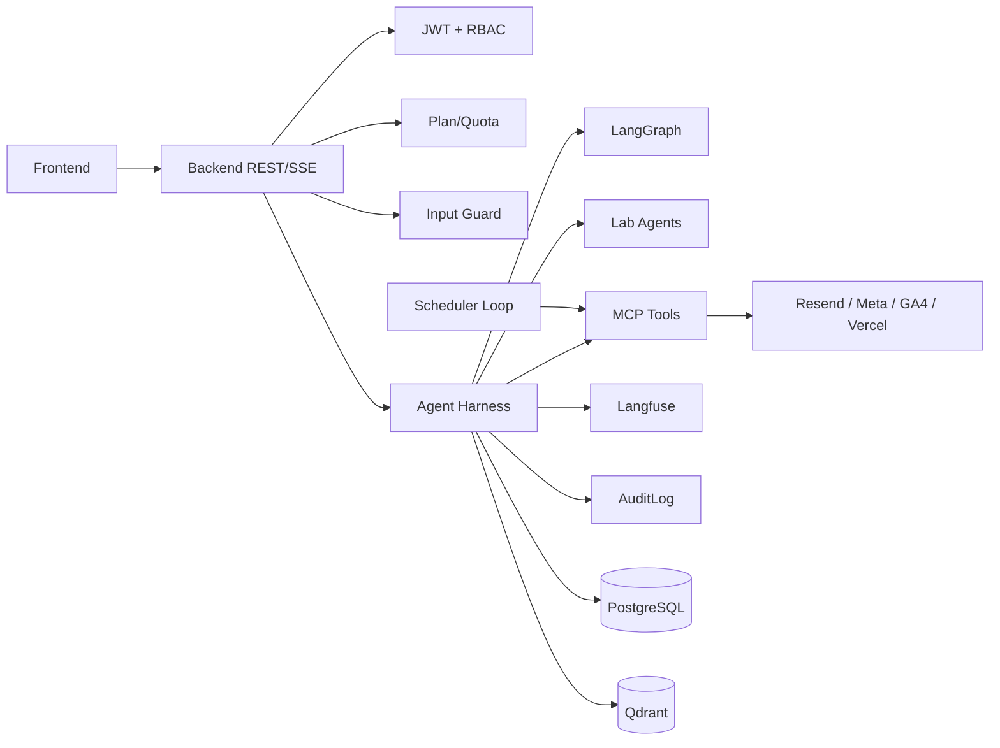

# System Architecture Overview

## Tóm tắt

Vitba.ai nên được nhìn như một nền tảng **AI marketing operating system**: người dùng nhập ý tưởng, hệ thống điều phối agents/tools, tạo nội dung, kiểm tra chất lượng, xuất bản đa kênh, đo lường hiệu quả và ghi lại toàn bộ audit trail.

## Kiến trúc logic

## Nguyên tắc xây chắc

1. **Backend enforce, frontend chỉ hiển thị**: quota, quyền, publish target, token ownership phải kiểm tra ở backend.
2. **Mọi mutation đều audit**: email send, meta post, landing deploy, schedule, feedback, lab run, generate.
3. **Mọi AI call đều trace**: model, tier, token, latency, prompt version, output schema, error.
4. **RAG phải tenant-safe**: mọi filter có `user_id`, optional `project_id`, optional `conversation_id`.
5. **Agent không tự do spawn agent khác**: dùng workflow template có kiểm soát.
6. **Job/publish cần idempotency**: tránh gửi email/post trùng.

## Boundary rõ ràng

| Boundary | Chịu trách nhiệm | Không nên làm |
|---|---|---|
| Frontend | UX, stream, polling, renderer, feedback input | Enforce quota, tự tin dữ liệu là source of truth |
| Backend API | Auth, quota, guard, persistence, orchestration | Gọi external API không audit |
| Agent Harness | Chuẩn hóa AI/tool execution | Chứa business logic mơ hồ không trace |
| LangGraph | Generate pipeline deterministic | Publish external side effect |
| MCP Hub | REST tools, mutation external | Suy luận AI tùy tiện |
| Scheduler | Xử lý due jobs | Chạy không lock trên multi-instance |
