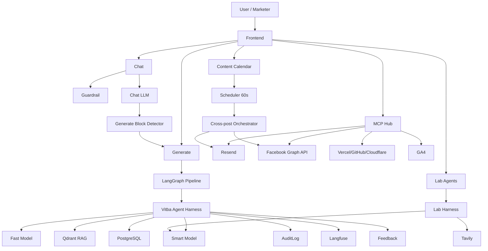

# Vitba Ecosystem Map

Vitba.ai là hệ sinh thái AI marketing gồm 6 lớp lớn:

## Lớp 1 — Product surface

- Chat AI.
- Generate content.
- Lab tools.
- Landing page.
- Email campaign.
- Meta posting.
- Content calendar.
- Admin analytics.

## Lớp 2 — AI orchestration

- [[LangGraph_Pipeline]] cho generate chính.
- [[Lab_Agents_MOC]] cho tools độc lập.
- [[Report_ReAct_Agent]] cho multi-stage research/report.
- [[Vitba Agent Harness]] để chuẩn hóa mọi lần gọi AI/tool.

## Lớp 3 — Tooling không phải AI

- [[Email_Resend_Module]]
- [[Meta_Graph_Module]]
- [[Landing_Deploy_Module]]
- [[SEO_HTML_Analyzer_Module]]
- [[Analytics_GA4_UTM_ROI_Module]]
- [[Calendar_Scheduler_Module]]

## Lớp 4 — Data & memory

- [[PostgreSQL_Models]] là source of truth.
- [[Qdrant_RAG]] cho retrieval.
- [[Redis_Session_Memory]] cho cache/lock/session TTL nếu bổ sung.
- [[Context_Loading_Policy]] quyết định context nào được nạp vào prompt.

## Lớp 5 — Safety/quality/observability

- [[Safety_Guardrails]]
- [[MCP_Mutation_Safety]]
- [[AuditLog_Action_Taxonomy]]
- [[Langfuse_Tracing]]
- [[Evaluation_and_Feedback_Loop]]

## Lớp 6 — Governance & roadmap

- [[Roadmap_Phases]]
- [[Definition_of_Done]]
- [[Security_Checklist]]
- [[Testing_Strategy]]
