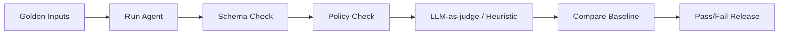

# Evaluation and Feedback Loop

Hiện kiến trúc có [[Reviewer_Agent]] tự chấm điểm 0-100, nhưng chưa có explicit user feedback. Đây là điểm cần bổ sung để hệ thống học từ chất lượng thật.

## 3 nguồn quality signal

| Signal | Nguồn | Tin cậy | Dùng cho |
|---|---|---:|---|
| Reviewer score | AI reviewer | Trung bình | quality gate, admin avg_score |
| User feedback | thumbs up/down + text | Cao | prompt improvement, ranking issues |
| Operational metrics | job success, edit rate, publish rate | Trung bình | phát hiện UX/tool lỗi |

## Feedback model

```python
class Feedback(Base):
    id: UUID
    user_id: UUID
    project_id: UUID | None
    target_type: str
    target_id: UUID
    rating: Literal["up", "down", "neutral"]
    reason: str | None
    correction: str | None
    tags: list[str]
    created_at: datetime
```

## Target types

```text
generation_job
content_history
lab_history
chat_message
landing_page
email_campaign
meta_post
calendar_item
```

## Feedback UI

Mỗi output card nên có:

- 👍 Hữu ích
- 👎 Chưa tốt
- Textbox: “Bạn muốn sửa gì?”
- Tags nhanh:
  - sai giọng thương hiệu
  - quá dài
  - thiếu CTA
  - sai thông tin
  - format lỗi
  - không đúng kênh
  - quá chung chung

## Feedback không đồng nghĩa retraining

Ở phase đầu:

1. Lưu feedback.
2. Tổng hợp theo tool/content type/prompt version.
3. Review thủ công các negative samples.
4. Cập nhật prompt/eval set.
5. Chạy regression trước khi release.

Không tự động fine-tune hoặc tự động đưa correction của user vào model training.

## Eval harness hướng tới



## Metrics nên có trong admin

- Feedback up/down ratio theo agent.
- Negative tags top 20.
- Reviewer score vs user feedback correlation.
- Output edit/resubmit rate.
- Publish success rate sau generate.
- Prompt version regression.

## Backlinks

- [[Reviewer_Agent]]
- [[User_Feedback_System]]
- [[Admin_Analytics]]
- [[Langfuse_Tracing]]
