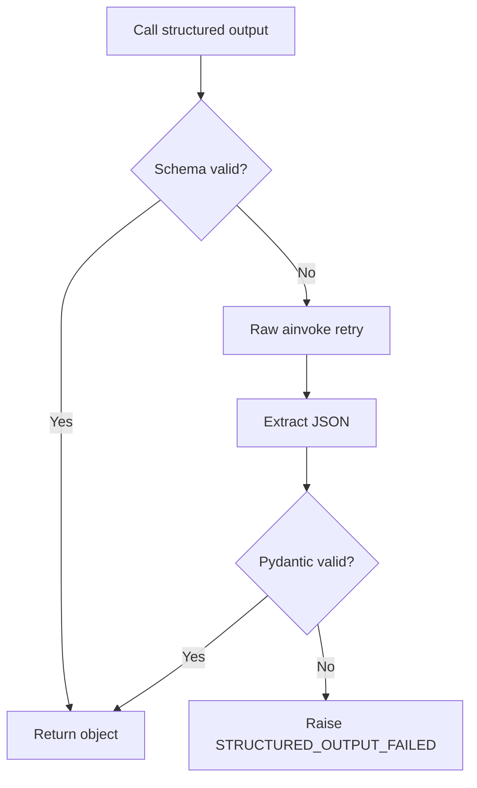

# Model Tiers and Structured Output

## Model tiers

| Tier | Dùng cho | Tính chất |
|---|---|---|
| `fast` | pipeline node thường xuyên | nhanh, rẻ, đủ tốt cho structured generation |
| `smart` | reviewer, lab agents, report, SEO Analysis | suy luận tốt hơn, chậm/đắt hơn |
| `none` | brand node, MCP REST tools, HTML analyzer | không gọi LLM |

## Quy tắc hiện tại

- `research`, `seo`, `fusion`, `copywriter`: `generate_structured("fast")`.
- `reviewer`: `generate_structured("smart")`, chỉ Pro/Max.
- `brand`: không LLM, chỉ RAG/DB.
- `landing_page_coder`: raw `ainvoke`, không structured.
- `marketing_planner_rag`: raw `ainvoke`, không structured.
- Lab tools: `generate_structured("smart")`.
- SEO Analysis: raw `ainvoke`, markdown report, 8192 tokens.

## Structured output fallback



## Wrapper contract

```python
async def generate_structured(model_tier, system_prompt, user_payload, schema, trace_metadata):
    try:
        return await provider.generate_structured(...)
    except Exception:
        raw = await provider.ainvoke(...)
        data = extract_json(raw.text)
        return schema.model_validate(data)
```

## Prompt versioning

Mỗi prompt nên có:

```yaml
prompt_id: copywriter.v1
owner: ai-team
updated_at: 2026-06-25
input_schema: CopywriterInput
output_schema: CopywriterOutput
eval_set: copywriter_basic_001
```

## Token policy

| Context | Budget gợi ý |
|---|---:|
| System prompt | 3k-4k tokens |
| RAG chunks | 4k-6k tokens |
| Chat history | Theo plan/token budget |
| Tool results | Compress trước khi đưa vào Writer |
| Output | Theo content type |

## Liên kết

- [[Graph_State_Context_Memory]]
- [[Evaluation_and_Feedback_Loop]]
- [[Error_Handling_Retry]]
