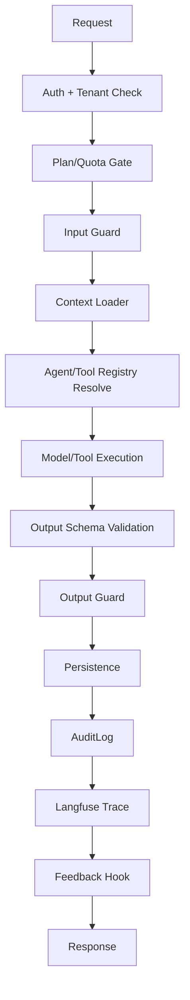

# Vitba Agent Harness

[[Vitba Agent Harness]] là lớp runtime mà hệ thống nên hướng tới để mọi agent/tool chạy thống nhất, an toàn, trace được và có thể mở rộng.

## Harness không phải là gì?

Harness **không phải** một super-agent tự quyết định mọi thứ. Nó là **execution framework** bao quanh các agent/tools đã đăng ký.

Không nên để harness tự do:

- Spawn agent bất kỳ.
- Gọi tool không có permission.
- Ghi DB ngoài contract.
- Bỏ qua quota/guardrail.
- Tự publish external side effect khi chưa qua policy.

## Harness là gì?

Harness là pipeline chuẩn cho mỗi lần gọi agent/tool:



## Mục tiêu

1. Chuẩn hóa cách chạy mọi agent: graph node, lab tool, ReAct, MCP commentary.
2. Giảm lỗi JSON/schema bằng wrapper chung.
3. Enforce quota/plan ở một nơi.
4. Bảo đảm mọi mutation có audit.
5. Bảo đảm mọi AI call có trace.
6. Cho phép sau này xây multi-agent workflow template có kiểm soát.

## Core interfaces

```python
class AgentSpec(BaseModel):
    name: str
    group: str
    mode: Literal["structured", "raw", "react", "tool_only"]
    model_tier: Literal["fast", "smart", "none"]
    input_schema: type[BaseModel]
    output_schema: type[BaseModel] | None
    skills: list[str]
    tools: list[str]
    quota_key: str
    guard_profile: str
    audit_actions: dict
    prompt_version: str | None
```

```python
class HarnessResult(BaseModel):
    ok: bool
    output: dict | str | None
    usage: dict
    trace_id: str | None
    audit_id: str | None
    errors: list[dict]
```

## Các mode chạy

| Mode | Dùng cho | Ví dụ |
|---|---|---|
| `structured` | LLM trả JSON validate bằng schema | Planner, Research, SEO, Fusion, Copywriter |
| `raw` | LLM trả markdown/html/raw text | SEO Analysis, Landing Page Coder |
| `react` | Agent gọi tools nhiều vòng | Report Researcher |
| `tool_only` | REST/logic không LLM | Brand node, SEO HTML analyzer, Resend, Meta |

## Guard profiles

| Profile | Dùng cho |
|---|---|
| `creative_content` | Copywriting, campaign, social post |
| `brand_safety` | Shield, HexBreaker, BlindSpot |
| `external_publish` | Email, Meta, Zalo, Calendar publish |
| `research_web` | Tavily search/extract/crawl |
| `html_generation` | Landing HTML |
| `analytics_commentary` | GA4/ROI commentary |

## Audit hooks mặc định

| Stage | Action |
|---|---|
| request accepted | `{agent}.start` |
| guard rejected | `guard.reject` |
| quota rejected | `quota.reject` |
| success | `{agent}.success` |
| error | `{agent}.error` |
| external side effect | `{module}.{mutation}` |
| feedback | `feedback.create` |

## Hướng phát triển

- Phase 1: dùng harness cho Lab Agents và LangGraph nodes.
- Phase 2: chuẩn hóa MCP mutation policy.
- Phase 3: thêm workflow templates có chain nhiều agents.
- Phase 4: thêm eval harness, golden dataset, regression tests.
- Phase 5: thêm skill registry để agent/tool được compose có kiểm soát.

## Liên kết

- [[Agent_Runtime_Contract]]
- [[Tool_Skill_Matrix]]
- [[Model_Tiers_and_Structured_Output]]
- [[Safety_Guardrails]]
- [[AuditLog_Action_Taxonomy]]
- [[Langfuse_Tracing]]
- [[Future_Agent_Harness]]
