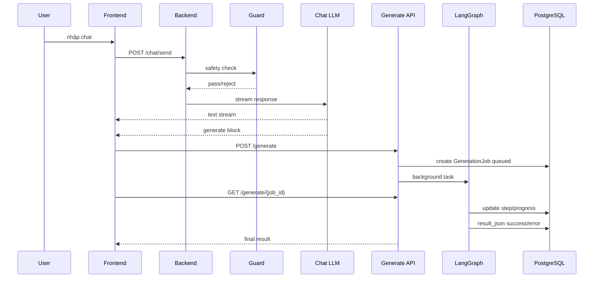

# Chat to Generate Flow

## Luồng chuẩn



## Generate block format

````md
```generate
{
  "content_type": "facebook_post",
  "input_data": {
    "topic": "...",
    "audience": "...",
    "tone": "..."
  }
}
```
````

## Backend validation

- `content_type` nằm trong registry.
- `input_data` đúng schema và size limit.
- User còn quota.
- Project/conversation thuộc user.
- Guard input pass.

## Frontend responsibilities

- Detect generate block.
- Hiển thị preview hoặc auto-submit tùy UX.
- POST `/generate`.
- Poll job.
- Render output.
- Gửi feedback.

## Rủi ro

| Rủi ro | Fix |
|---|---|
| LLM emit generate block sai JSON | frontend parse fail + backend validate schema |
| User hết quota sau chat | backend trả 429 + upgrade hint |
| Generate block malicious | guard + schema allowlist |
| Job polling quá dày | sleepUntilVisible/backoff/SSE phase sau |
