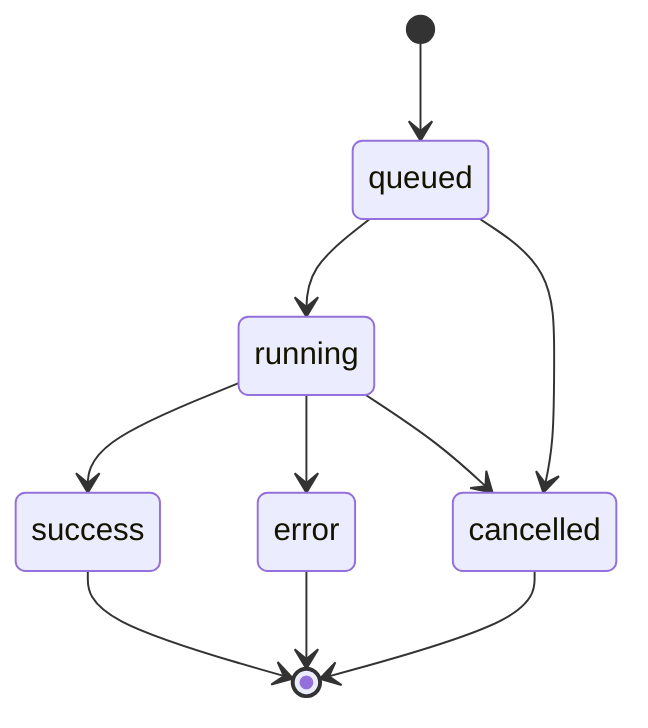

# GenerationJob State Machine

`GenerationJob` là state machine cho mỗi lần generate.

## Trạng thái



## Fields chính

| Field | Ý nghĩa |
|---|---|
| `id` | UUID job |
| `user_id` | owner |
| `project_id` | project scope |
| `conversation_id` | chat scope |
| `content_type` | loại nội dung |
| `input_data` | input gốc |
| `result_json` | output cuối |
| `status` | queued/running/success/error/cancelled |
| `current_step` | node hiện tại |
| `progress` | 0-100 |
| `error_message` | safe error |
| `plan_snapshot` | plan tại thời điểm chạy |
| `trace_id` | Langfuse trace |

## Progress gợi ý

| Step | Progress |
|---|---:|
| queued | 0 |
| route | 5 |
| planner | 15 |
| research/seo/brand | 35 |
| fusion | 50 |
| copywriter | 70 |
| reviewer | 85 |
| formatter | 95 |
| success | 100 |

## Invariants

- Không update ngược `success → running`.
- Job chỉ đọc được bởi owner/project member.
- `result_json` chỉ có khi success.
- Error phải safe cho UI, stack trace chỉ ở log/trace sanitized.
- Job runner cần idempotency để tránh chạy cùng job 2 lần.

## Polling frontend

Frontend hiện polling `/generate/{jobId}` mỗi 800ms với `sleepUntilVisible`.

Khuyến nghị phase sau:

- SSE job progress.
- Backoff khi tab hidden.
- Retry GET job khi network lỗi.
- UI hiển thị step human-readable.

## Audit actions

```text
generate.start
generate.step
generate.success
generate.error
generate.cancel
```
