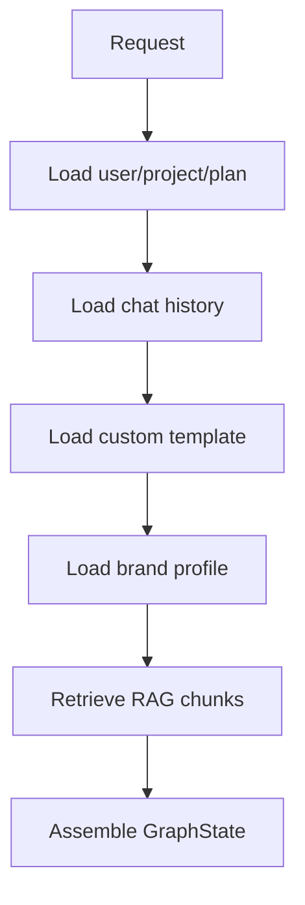

# Graph State Context Memory

## GraphState đề xuất

```python
class GraphState(TypedDict, total=False):
    user_id: str
    project_id: str | None
    conversation_id: str | None
    job_id: str
    plan: dict

    content_type: str
    input_data: dict
    chat_history: list[dict]
    rag_chunks: list[dict]
    brand_profile: dict | None
    custom_template: dict | None

    route: str
    plan_output: dict | None
    research_output: dict | None
    seo_output: dict | None
    brand_output: dict | None
    fusion_output: dict | None
    copy_output: dict | None
    review_output: dict | None
    formatted_output: dict | None

    current_step: str
    usage: dict
    errors: Annotated[list[dict], operator.add]
```

## Context sources

| Context | Source | Loader | Dùng ở đâu |
|---|---|---|---|
| Chat history | PostgreSQL | 12 messages hiện tại | chat prompt, generate prompt |
| RAG chunks | Qdrant | hybrid dense + sparse | chat, brand, marketing_plan |
| Brand profile | PostgreSQL | BrandProfile dict | copywriter, formatter |
| Plan/limits | quota service | get_user_plan | system prompt, route gate |
| Custom template | PostgreSQL | UserTemplate | formatter |
| Onboarding answers | PostgreSQL/API | onboard form | landing/email AI |

## Context loading policy



## Reducer cho errors

`errors` dùng `operator.add` để các node parallel có thể append lỗi mà không overwrite nhau.

## Không có session memory hiện tại

Hệ thống hiện là stateless REST + JWT. Graph state chỉ tồn tại trong lúc job chạy. Nếu cần session memory, xem [[Redis_Session_Memory]].

## Rủi ro

- Chat history 12 messages có thể thiếu context.
- RAG filter sai có thể leak dữ liệu.
- Brand profile stale có thể làm copy sai tone.
- Custom template lỗi có thể làm formatter fail.

## Fix khuyến nghị

- Dynamic chat history theo token budget.
- Conversation summary memory cho Pro/Max.
- Strict RAG filter `user_id + project_id + conversation_id`.
- Validate template trước khi apply.
