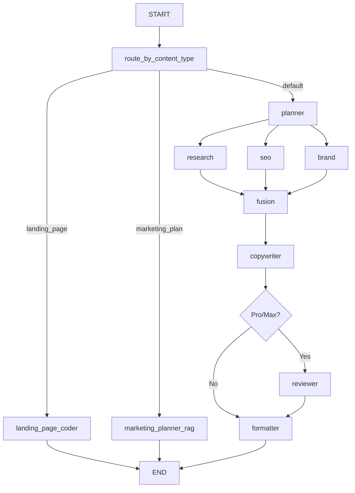

# LangGraph Pipeline

## Pipeline hiện tại



## Node list

| Node | Vai trò | Mode | Model |
|---|---|---|---|
| `route_by_content_type` | Chọn path | deterministic | none |
| `landing_page_coder` | Tạo raw HTML nhanh | raw | fast |
| `marketing_planner_rag` | Tạo marketing plan JSON từ RAG | raw | fast |
| `planner` | Lập kế hoạch content | structured | fast |
| `research` | Tạo insight/risk/open questions | structured | fast |
| `seo` | Tạo SEO brief | structured | fast |
| `brand` | Nạp brand/RAG context | tool_only | none |
| `fusion` | Hợp nhất plan/research/seo/brand | structured | fast |
| `copywriter` | Viết nội dung | structured | fast |
| `reviewer` | Chấm điểm/cải thiện | structured | smart |
| `formatter` | Format theo template/kênh | custom | none/fast |

## Nguyên tắc

- Node trả về partial state, không mutate trực tiếp.
- Lỗi node phải có `node`, `code`, `recoverable`.
- `reviewer` chỉ chạy cho Pro/Max.
- `brand` không gọi LLM.
- Landing/marketing_plan là fast path, không đi qua pipeline default.

## State transition

```text
queued → running: route_by_content_type
running: current_step cập nhật theo node
success: formatted_output/result_json tồn tại
error: error_message có code + safe message
```

## Liên kết

- [[Graph_State_Context_Memory]]
- [[GenerationJob_State_Machine]]
- [[Planner_Agent]]
- [[Copywriter_Agent]]
