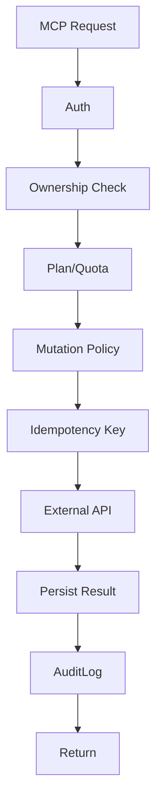

# MCP Hub MOC

MCP Hub trong Vitba là nhóm **REST tools không phải AI**. Các module này thực hiện side effects thật: gửi email, đăng bài, deploy landing, đọc analytics, xử lý lịch.

## Modules

- [[Email_Resend_Module]]
- [[Meta_Graph_Module]]
- [[Landing_Deploy_Module]]
- [[SEO_HTML_Analyzer_Module]]
- [[Analytics_GA4_UTM_ROI_Module]]
- [[Calendar_Scheduler_Module]]
- [[Cross_Post_Orchestrator]]

## Runtime policy

## Guardrails bắt buộc

- Validate ownership của recipient/list/page/project/deployment.
- Encrypt OAuth/API tokens.
- Không log secrets.
- Có idempotency key cho side effect.
- Có retry/backoff cho lỗi transient.
- Partial failure phải lưu rõ.

## Audit action prefix

| Module | Prefix |
|---|---|
| Email | `email.*` |
| Meta | `meta.*` |
| Landing | `landing.*` |
| SEO | `seo.*` |
| Analytics | `analytics.*` |
| Calendar | `calendar.*` |
| Orchestrator | `orchestrator.*` |
