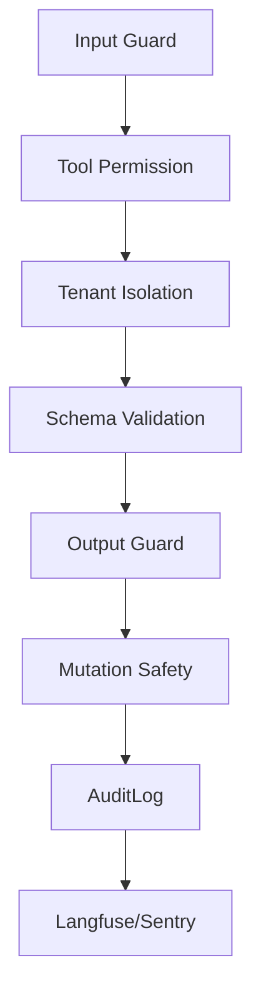

# Guardrails Audit MOC

## Notes

- [[Safety_Guardrails]]
- [[MCP_Mutation_Safety]]
- [[AuditLog_Action_Taxonomy]]
- [[Langfuse_Tracing]]
- [[Error_Handling_Retry]]
- [[Security_Checklist]]

## Golden rule

```text
No AI/tool execution without guard + quota + trace.
No external side effect without policy + idempotency + audit.
```

## Layers


