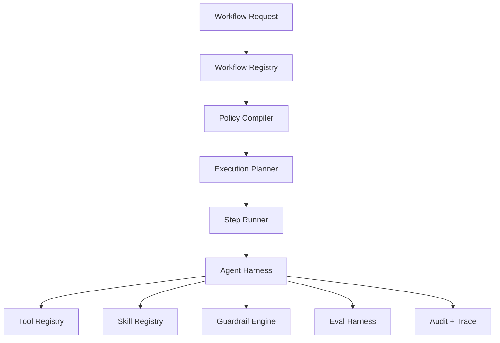

# Future Agent Harness

File này mô tả hướng harness nên tiến tới khi Vitba mở rộng multi-agent.

## Target architecture



## Components

| Component | Vai trò |
|---|---|
| Workflow Registry | Lưu workflow templates versioned |
| Agent Registry | Lưu agent specs |
| Tool Registry | Whitelist tools và permission |
| Skill Registry | Chuẩn hóa skills agent có thể dùng |
| Policy Compiler | Chuyển plan/quota/guard thành execution policy |
| Step Runner | Chạy từng step với schema/trace/audit |
| Eval Harness | Test output trước release/publish |

## Skill registry future

```yaml
skill: brand_voice_adaptation
allowed_agents:
  - Copywriter
  - Formatter
required_context:
  - BrandProfile
forbidden_tools:
  - external_publish
```

## Khi build harness future

- [ ] AgentSpec schema.
- [ ] ToolSpec schema.
- [ ] WorkflowSpec schema.
- [ ] SkillSpec schema.
- [ ] PolicySpec schema.
- [ ] Parent-child tracing.
- [ ] Per-step quota.
- [ ] Eval regression.
- [ ] Human approval gate cho publish.

## North star

Harness phải giúp Vitba mở rộng từ 40+ tools lên 100+ tools mà không mất kiểm soát về bảo mật, chi phí, latency, audit và chất lượng.

## Backlinks

- [[Vitba Agent Harness]]
- [[Controlled_Agent_Chaining]]
- [[Evaluation_and_Feedback_Loop]]
