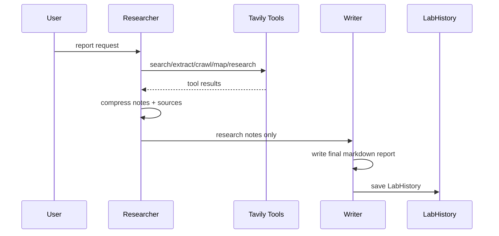

# Report 2 Stage ReAct

Report là multi-agent pattern duy nhất hiện có.

## Architecture



## Researcher responsibilities

- Query planning.
- Tavily search/extract/crawl/map/research.
- Source collection.
- Notes compression.
- Confidence/limitations.

## Writer responsibilities

- No tool access.
- Use research notes only.
- Write final markdown.
- Separate facts from interpretation.
- Include limitations.

## Guardrails

- Max tool calls: 6-8 mặc định.
- Researcher không viết final.
- Writer không gọi tool.
- Sources phải được giữ trong metadata.
- Không bịa nguồn.

## Audit actions

```text
lab.report.start
lab.report.tool_call
lab.report.research.done
lab.report.writer.start
lab.report.success
lab.report.error
```

## Backlinks

- [[Report_ReAct_Agent]]
- [[Production_Lab_Tools]]
- [[Multi_Agent_Principles]]
