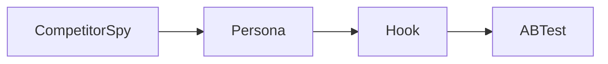
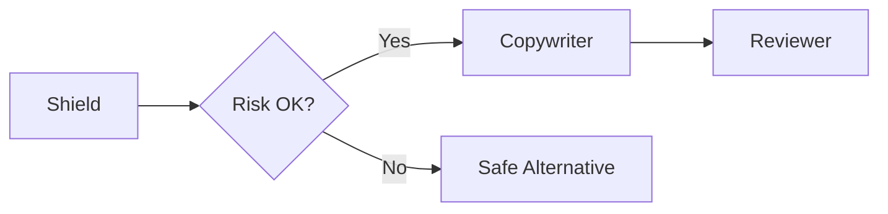
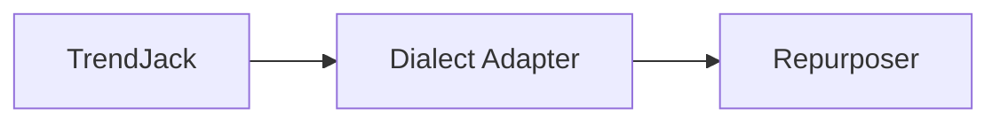
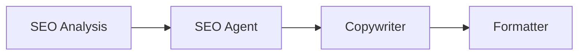

# Workflow Templates

Workflow template là cách chain nhiều agent/tools có kiểm soát.

## Template schema

```yaml
name: competitor_to_campaign
version: v1
steps:
  - id: competitor
    agent: CompetitorSpy
    input_map: request
  - id: persona
    agent: Persona
    input_map: competitor.output
  - id: hooks
    agent: Hook
    input_map: persona.output
  - id: abtest
    agent: ABTest
    input_map: hooks.output
policies:
  max_steps: 4
  stop_on_error: true
  require_review_before_publish: true
```

## Workflow 1 — Competitor → Persona → Hook → ABTest

Dùng khi cần từ phân tích thị trường ra ý tưởng ads.



## Workflow 2 — Shield → Copywriter → Reviewer

Dùng cho ngành/rủi ro nhạy cảm.



## Workflow 3 — TrendJack → Dialect Adapter → Repurposer

Dùng cho content Việt Nam đa kênh.



## Workflow 4 — SEO Analysis → Content Brief → Copywriter

Dùng để tối ưu SEO content.



## Required controls

- Quota tính từng step.
- Audit từng step.
- Trace parent-child spans.
- Output schema từng step.
- Stop policy rõ.
- Error rollback nếu có external side effect.

## Backlinks

- [[Controlled_Agent_Chaining]]
- [[Tool_Skill_Matrix]]
- [[Future_Agent_Harness]]
